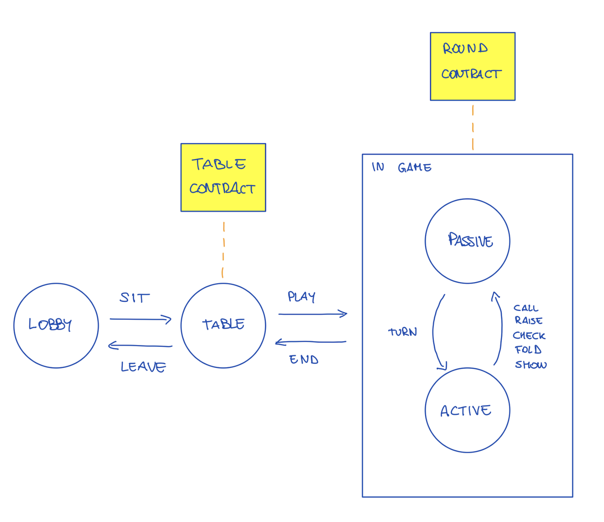
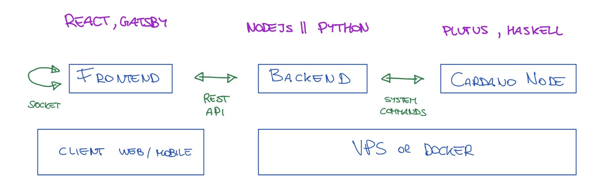
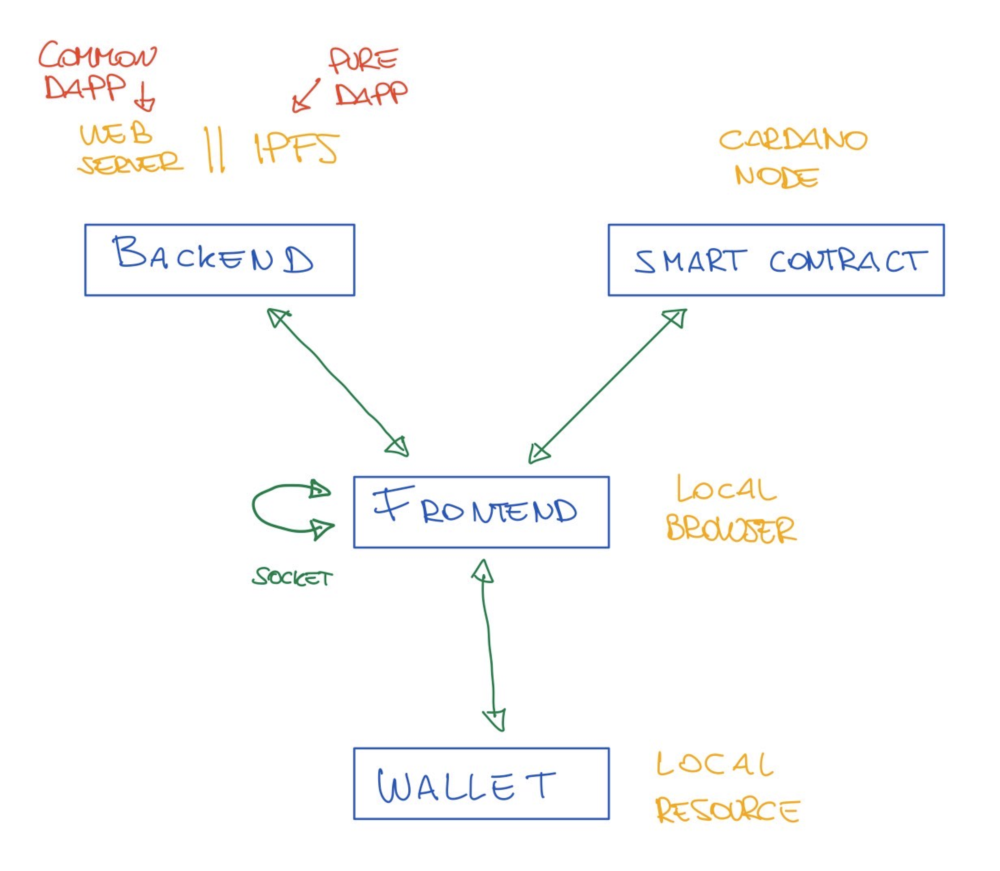

# Architecture

This document is to represent the current status of the project's architecture. 

Please, note: some of the architectural discussions are noted in this [Miro board](https://miro.com/app/board/o9J_lhLk_UY=/)

# Table of Contents
1. [States of the Game](#states-of-the-game)
2. [Initial Implementation](#initial-implementation)
3. [DApp Implementation](#dapp-implementation)

## States of the Game

When the user enters he is in the lobby.
Then the user sits in a table, and deposit an amount as escrow, e.g. 500. Such amount is locked in the table contract.
Then, the user starts to play. For each round, there is a new contract. In the round, the user can have only two states: 
* passive when he waits for his turn
* active, when he has a certain time to perform one of the possible actions: CALL, RAISE, CHECK, FOLD, SHOW.

When the round ENDs, the Round contract is sent back to the table and written into a sidechain (such that we’re fast, with no fees). Note: If a player drops out of a round, he renounces at any amount that was staked in the Pot, and waits for the next round.
When a player LEAVEs the table, the Table contract is written into the Blockchain, and the amounts are regulated.

Note: 
* With hydra we could have a sidechain for free and pool many table contracts in one, so to reduce fees. 

## Initial Implementation

To have a fast development cycle, we start with an initial implementation following the classic client-server approach, where we have: 

* *Frontend*: presenting the UI and talking with the _Backend_, and with the _Wallet_.
* *Backend*: Implementing the Game logic, sending information to the _Frontend_, and sending commands to the _Cardano Node_.
* *Cardano Node*: Where the smart contract is running. 
* *Wallet*: Where the player keeps his money

During the _Initial Implementation_, we have to keep clear understanding of the communications between the components, and how to transform this communication once we implementa the

## DApp Implementation

Once we have a working MVP for the _Initial Implementation_, and when our ideas are clear on how to proceed implementing the _DApp_, we could proceed implementing a real _DApp_, that should look like the image below.

