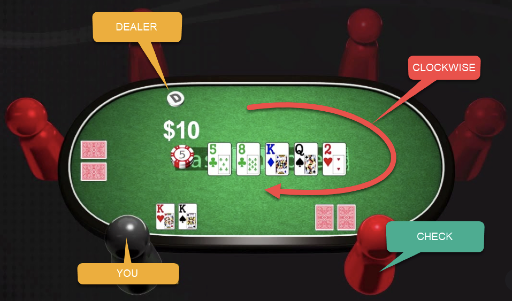

# Texas Hold’em
Below is an explanation of the texas hold’em from https://easy.poker/how-to-play-poker/ 

## Start
Each player is dealt two cards facing down. These two cards are called hole cards, are for your eyes only, and must be kept a secret.

Once all the cards are dealt, the two players sitting clockwise from the dealer will put the small- and big-blind. This type of ante ensures that we always have chips on the table at each round.

## The Flop 
All players will have to at least match the big blind in order to continue to the next round. This is called Call. Players also have the option to Fold and Raise.

After the initial betting round, three new cards will be put on the table for all player to see. This is called the flop. The cards on the table are called Community Cards, and are for all players to combine with the cards in their hands.

After the flop, comes another round of betting starting with the player sitting left of the dealer. All the players who wish to stay in the rebound have to match the highest bet, like in the initial betting round. Unlike the initial round, players now also have the option to check, that means not to bet nor fold. This will simply let co to the next round - but only if nobody makes a bet. If one of the other players bet, you will have either to fold, call, or raise. 

## The Turn
The dealer burns the top card of the deck and then draws a fourth community card, face up on the table. After that the players have another round of betting.

## The River (final card)
The dealer burns another card from the top of the deck and draws a fifth and final community card for the table. After that the players have another round of betting

The player with the highest 5 card combination among the community cards + hole cards wins and gets all the pot: the chips betted during the round.

