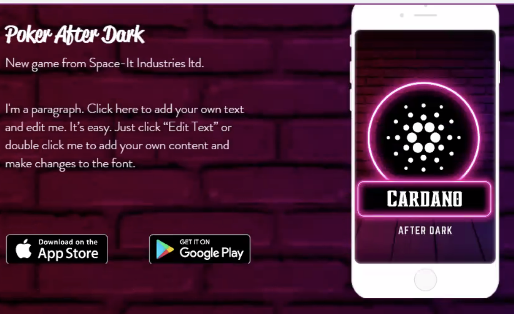
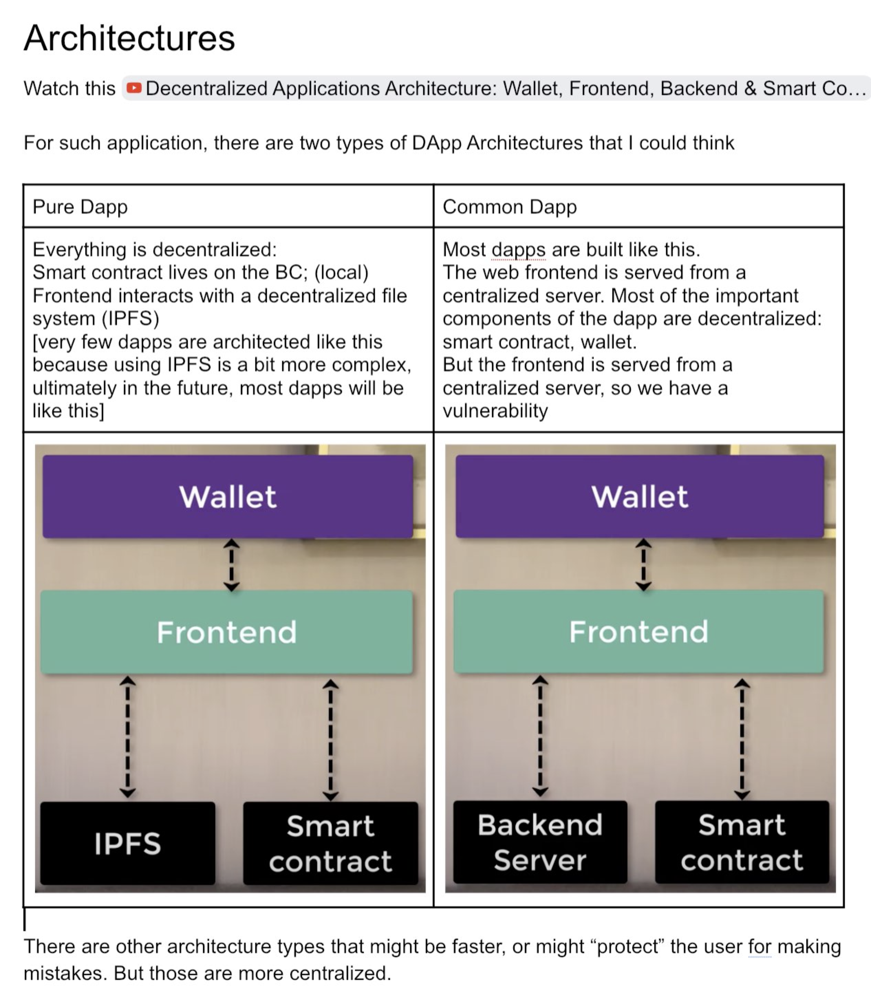
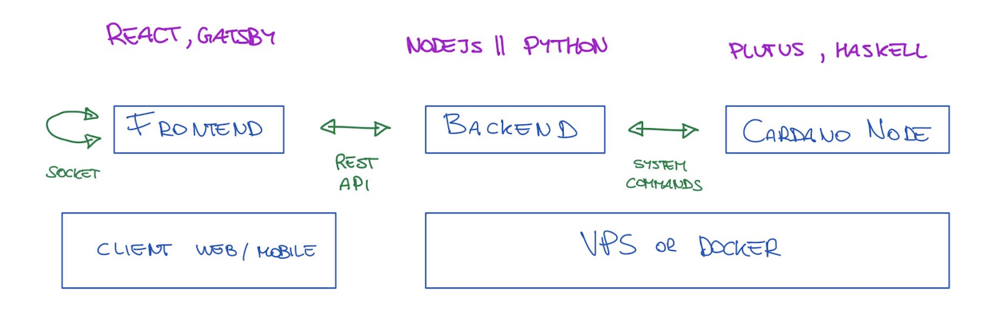
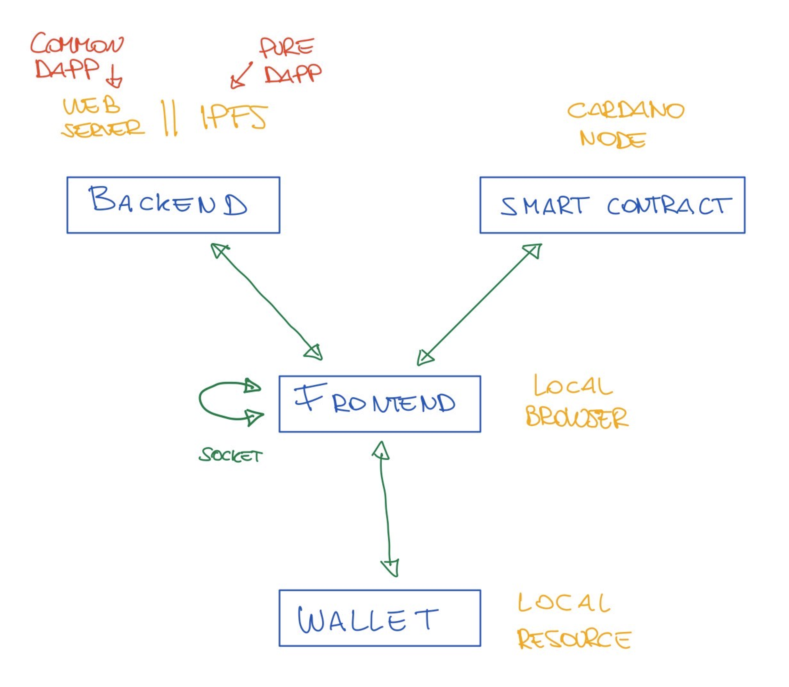

# 2021.11.29 - CAD Meeting

## Initial idea for Website

We started with an initial presentation from Shannon who did a Comptetitive Analysis followed by an Idea for the website.

## What are we missing - wallet

Nori points the fact that Cardano lacks something like metamask. 
A commonly used wallet is Yoroi by emurgo: https://yoroi-wallet.com/#/
But MetaMask provides additional features, and on mobile becomes stgh like a browser → we should define better the missing features, and perhaps write a proposal for F8?

Demo by Nori: Metamask - Sandbox.gameexample

The wallet not only keep funds, but also provides Crypto certificates to prove that is you. 
Does it provides Identity ?

CNT does something similar : wallet address transaction to verify that you are the owner of the wallet. Then you are associated to the identity. 
There should be an example posted on Cardano for climate one month ago 

About the missing features from the wallet
→ Adriano’s Gamechanger Wallet - we need more info, please ADD INFO HERE

## Initial idea about architecture

Watch this video to get an idea of the most common dapp architectures: https://www.youtube.com/watch?v=JUXeIIhOxpE

The two most plausible architectures are represented in the image below.

For the above architecture we need IPFS (Pure Dapp) and a contract on-chain (Common Dapp). Both the options are good for a final application. But for a MVP we should start in a simpler way, e.g. with a simple Client/Server architecture.

Then, when we're done with a client-server architecture, we could transition to a real blockchain model, where we implement either a Common Dapp or a Pure Dapp. In either cases, we will have something similar to the image below.

## Expert's discussion about architecture

Jude: Let’s have a state machine that we use to describe the actions , 

Mert Akyazi - Clockchain :  

Poker game not always on chain data,. You can’t mke transaction for each player action. 
Off chain ledger stored in the database. But at the end of the game, the game is written on chain. The data associated to the game is then used/validated by 

Offchain data though cannot be really verified. Beforehand the contract knows nothing about the game, for the offchain ledger.

At each stage, each player sends data representing the action - with timestamp -  and signs the data with his private key. The centralized server receives such data, and uses the Public Key to verify the signer. Everybody does this, until the round is done. When the round is done, the centralized server writes a summary of the game played as single transaction on the blockchain 

Jude: Understand the idea, but note that in Cardano it is possible to have off chain validation. (Then provides to explain the mechanics to Mert and all the participants)

Jude: In Cardano the transactions are deterministic. we cannot think that we have a token having validation  [..] in ETH you can query all the blockchain for a state, while in Cardano you can query only the state for the parties participating to the eUTXO transaction. 

In Cardano the transaction fee is deterministic, so it is simpler to calculate the total cost of the transaction and the collateral. 

/on ETH you cannot verify off-chain. You cannot estimate the Gas (precisely) - On Cardano you can (is deterministic)

Mert: you can validate offchain, but then, there are ways of making the initial transaction null. 

Jude, that does not apply to Cardano. In Ethereum is possible. 

Mert explains how is possible to invalidate an off-chain transaction by sending tro transactions one to the poker app, and the other of null value, with higher gas fee that will invalidate the first one. 

Jude explains how that is not possible on Cardano.
